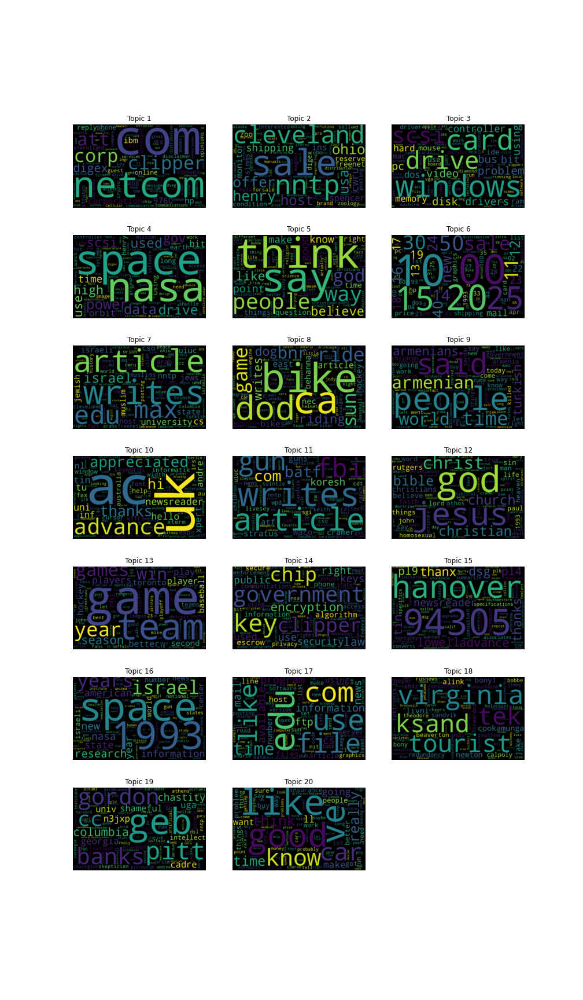
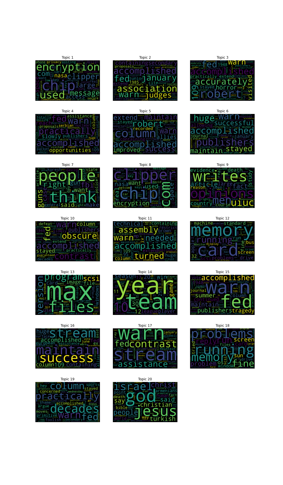
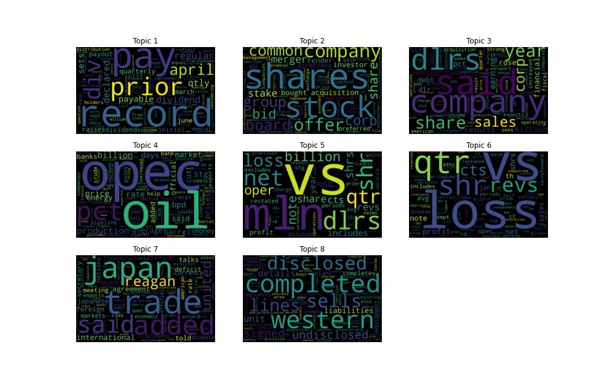
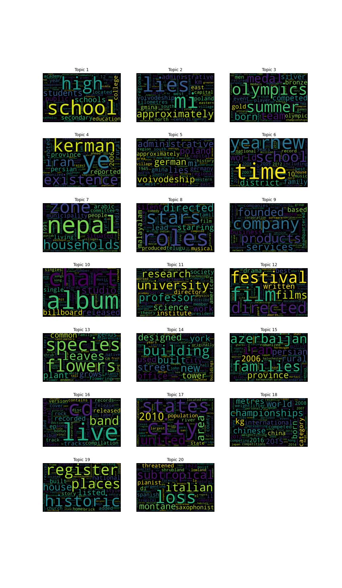

# NeuralVariationalTopicModeling
 Topic Modeling using VAEs
## About -
The codebase contains Topic Modeling implementation using VAEs (Variational Auto Encoders). Code is editable and can be changed easily. Standard Libraries are used (just install Anaconda and PyTorch).

## VAEs -
The VAE model is provided with 4 choices of distributions for the prior/latent space, namely - LogNormal, Dirichlet, Laplace, and Gamma. It can be chosen as a hyperparameter in the config.py file.

## Datasets -
Few standard datasets are given in the 'data/' directory. New data in '.txt' format can be easily added to the directory and the filename can be given as a hyperparameter to use the new data in the model.

## Output -
The output for every run is saved in the 'output/' directory. Every run will be given a unique directory name in the 'output/' directory consisting of the current time and user-given name input.

As of now, the output contains visual word clouds in 'wordclouds.png'. In 'topic.txt' for the top 30 words in each topic can be found. A log file named 'logfile.log' is also generated for logging the important information regarding a particular run.

## GPU Support
The code supports GPU training. Hence, it is recommended to use GPU (Cuda) for training the model since training on CPU might take a long time.

## Results -
Few results with different settings are provided in the output directory already.

Below are some of the results in form of word clouds with different settings (more can be found in output/ directory) -

*Note: The results shown below are pre-mature since the model was only run for 20 epochs to demonstrate usability. Further hyperparameter and model tuning combined with longer runs can improve the results significantly.*

1. 20 News Group with Dirichlet Distribution as Prior

2. 20 News Group Dataset with Log-Normal Distribution as Prior

3. Reuters 8 Dataset with Dirichlet Distribution as Prior

4. Wikipedia Corpus with Dirichlet Distribution as Prior
